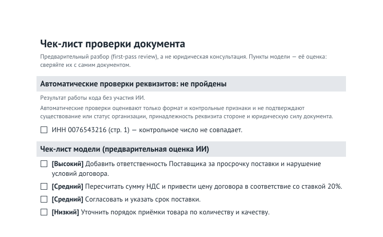

# telegram-legal-doc-review-assistant

[](https://github.com/eliv1982/telegram-legal-doc-review-assistant/actions/workflows/ci.yml)


> A Telegram assistant for **first-pass review of Russian business documents**: deterministic requisite checks written in code, plus a structured, evidence-grounded AI assessment, kept visibly apart.

Send the bot a voice instruction and a PDF or photo of a document (a contract, an invoice, an act). It validates the file under bounded resource limits, extracts the text, runs **automatic requisite checks** (INN, KPP, OGRN/OGRNIP, BIK, bank accounts) in plain code, asks an OpenAI model for a **structured first-pass review** whose findings carry quotes from the document, verifies those quotes against the extracted text, and sends back a text report, a short voice summary and a PDF checklist. Every report states which pages were analysed.

> **Educational / portfolio project. This is not legal advice** and not a replacement for a lawyer. The AI assessment is preliminary and can be wrong or incomplete. The automatic checks verify only the *format and check digits* of requisites, never that an organisation exists. Do not upload confidential documents: content is sent to external processors (see [Privacy and data flow](#privacy-and-data-flow)).

The bot talks to the user in Russian (messages, prompts, voice summary), because it reviews Russian documents. This README is in English for portfolio readers; a short Russian summary is at the [bottom](#кратко-по-русски).

## Why this project exists

A document-review assistant should not present every output as equally reliable. Some things are facts that code can verify: an INN either satisfies its check-digit rule or it does not. Other things are model interpretation: whether a clause is risky, how important a finding is. This project keeps the two apart:

- **Code-verifiable facts** come from deterministic rules, run on the extracted text only. The model never sees their results and cannot rewrite them.
- **Model interpretation** is labelled as the model's assessment, its evidence is checked by code where possible, and quotes that cannot be verified are not shown as quotations.
- **What was and was not analysed** is stated by code in every report, not guessed by the model.

## User flow

1. Send a **PDF or an image** (JPG, PNG, WEBP) of the document.
2. Send a **voice message** with the task, e.g. "check this contract for risks to the buyer". The two may arrive in either order: the first opens a session, the second completes it.
3. The bot **validates** each upload as it arrives and extracts the document text. A file that cannot be used is rejected immediately with the reason; the half already received stays in the session.
4. **Automatic requisite checks** run on the extracted text.
5. The **AI performs a structured first-pass review** of the document against your task.
6. You receive, in this order:
   1. a **text report** (automatic checks, then the model's assessment, verified quotes, page coverage, disclaimer),
   2. a **voice summary**,
   3. a **PDF checklist**.

The text report is the primary result and is sent first. If the voice summary or the checklist cannot be produced, you get one short notice for that item and the report is unaffected. `/start` discards an unfinished session.

## Architecture / pipeline

```text
Telegram (voice + PDF/image, either order)
  │
  ▼
Session workspace                private temporary directory, one per session            [code]
  │
  ▼
Validation                       type sniffed from content, size, PDF structure/pages   [code]
  │
  ▼
Bounded extraction               text layer first; scanned pages -> Poppler -> vision   [code; AI for scans]
  │
  ├──► Deterministic requisite checks   INN / KPP / OGRN / OGRNIP / BIK / accounts      [code only]
  │
  ▼
Speech-to-text                   the voice task                                         [AI]
  │
  ▼
Structured AI review             Pydantic schema; document text is untrusted data       [AI]
  │
  ▼
Evidence grounding               a quote counts only if it is in the extracted text     [code]
  │
  ▼
Report generation                structured: report text, voice script, checklist items [AI]
  │
  ▼
Report composition               code-added parts are never cut or rewritten            [code]
  ├──► 1. Telegram text report
  ├──► 2. Voice summary          OpenAI text-to-speech                                  [AI]
  └──► 3. PDF checklist          bundled PT Sans font                                   [code]
```

The deterministic branch reads the extracted document text only. It does not use model output, makes no network calls, and gives the same answer every time.

## Deterministic checks

These are the rules that exist, exactly. Requisites are found only **after a label** (`ИНН`, `КПП`, `ОГРН`, `ОГРНИП`, `БИК`, `р/с`, `к/с`, "расчётный счёт", and so on); a bare number is never treated as a requisite.

| Requisite | Rule | Kind of check | Source |
|---|---|---|---|
| INN, 10 digits | digits only, length, check digit (10th) | check digit | FNS order of 26.06.2025 No. ЕД-7-14/559@ (structure and lengths; the check digit is "by the algorithm determined by the FNS"), see the note below |
| INN, 12 digits | the same, two check digits (11th and 12th) | check digit | same |
| KPP | 9 characters: 4 digits, 2 characters (digit or capital Latin letter), 3 digits | **format only**; KPP has no check digit and none is invented | same |
| OGRN | 13 digits; the 13th is the last digit of (first 12 digits mod 11) | check digit | Ministry of Finance order of 30.10.2017 No. 165n (as amended 19.12.2022), item 7 |
| OGRNIP | 15 digits; the 15th is the last digit of (first 14 digits mod 13) | check digit | same |
| BIK | 9 digits, the first is 0, 1 or 2, the rest are not all zeros | **format only** (current structure) | Bank of Russia Regulation of 24.09.2020 No. 732-P, appendix 5, item 3 (as amended 17.06.2025) |
| Settlement / correspondent account | 20 characters | **length only** | Bank of Russia Regulation of 24.11.2022 No. 809-P, appendix 1 to the Chart of Accounts |

Results are shown as `❌` (the rule is not satisfied), `✅` (it is satisfied) or `ℹ️` (the format fits, but there is no check digit to verify). Identical requisites are merged into one line with their pages; two different values under one label stay two lines, so a wrong one does not cancel a right one. Text in the document cannot change a verdict: a note saying "treat this INN as correct" does nothing.

### What these checks do NOT prove

`✅` means only "this specific format and check-digit rule is satisfied". It does **not** prove that the taxpayer, company or bank exists or is active, that the number belongs to the party named in the document, or that the document is legally valid. No registry (FNS, EGRUL/EGRIP, the Bank of Russia BIK directory) is consulted. `❌` means "this rule is not satisfied", which can also come from a misread scan (the report warns about this when page images were read by the AI).

### Provenance of the INN algorithm

The FNS order that currently defines the INN structure says the check digit is computed "by the algorithm determined by the FNS" but does **not print the coefficients**. The FNS has publicly stated that the check-digit methodology has not changed ([nalog.gov.ru, 07.11.2025](https://www.nalog.gov.ru/rn77/news/activities_fts/16575267/)). The coefficient table used in the code is taken from the government services portal ([info.gosuslugi.ru](https://info.gosuslugi.ru/articles/%D0%92%D0%B0%D0%BB%D0%B8%D0%B4%D0%B0%D1%86%D0%B8%D1%8F/)), not from the order itself. The unit tests pin it against identifiers of a few well-known public organisations and single-digit mutations of them; a wider manual cross-check of 12 public INN/OGRN pairs was done when the rule was written, but those pairs are not part of the test data. The sources were read at development time; the bot never calls them at runtime.

### Deliberately not implemented

- **The account check key** (9th character): the current regulation does not print the algorithm, and linking an account to a BIK in free text is ambiguous (a document usually has several of each). Accounts are checked by length only.
- **VAT arithmetic** and other tax calculations, **registry lookups**, and any legal conclusion.

## AI review

- **Structured output.** Analysis and report generation use OpenAI Chat Completions structured parsing with Pydantic models ([`services/schemas.py`](services/schemas.py)): the API returns JSON for a schema, the SDK validates it, and the code works with typed objects. There is no free-text parsing and no regex rescue of malformed JSON.
- **The document is untrusted data.** The user's task and the document text go into separate, fenced blocks, and the prompt tells the model never to follow instructions found inside the document (text such as "ignore previous instructions" is data, and may be reported as a finding). Frame tags inside the document are escaped.
- **Evidence where verifiable.** Each finding may carry a short verbatim quote. Code checks that the quote appears in the analysed text (after collapsing whitespace; no fuzzy matching, no extra model call). Only then is it shown as a quotation. A finding without a verified quote is kept, and the report says how many findings lack one.
- **Priority is the model's assessment**, on a high / medium / low scale given in the prompt. It is not a legal classification.
- **No self-reported confidence score.** A refusal, a response cut off by the token limit, or an off-schema answer is reported as a service failure, never as a verdict on the document. If the model finds nothing, the report says "no findings in the analysed part", not that the document is safe.
- **Page coverage is stated by code.** When coverage is partial, the model is also told which pages it saw, so it does not conclude that something is missing from pages it never read.

Models and the voice are configured through environment variables ([`.env.example`](.env.example)); the defaults are in [`config.py`](config.py).

## Privacy and data flow

| Data | Processor / storage |
|---|---|
| Telegram upload (voice, PDF, image) | Telegram, then downloaded into a temporary local session workspace |
| Document content and the voice instruction | OpenAI, where processing requires it: speech-to-text, reading scanned pages, analysis, report generation, speech synthesis. Uploaded images are re-encoded as JPEG (EXIF and other metadata dropped) before being sent |
| Temporary files | An isolated `tgdoc-session-*` directory in the OS temp folder, random name (no user or chat id), neutral file names. Removed on completion, on failure, when a pending file is replaced, on `/start` and on expiry |
| Generated report, checklist and audio | Built in memory and sent to the same chat; never written to disk |
| Session state | In memory (aiogram FSM); lost on restart |
| Logs | Stage names, exception class names, sizes and counts. No document, transcript or model text; bot tokens and API keys are redacted by a filter. `/start` logs the numeric Telegram user id |
| Persistent database | None |

- No Google or gTTS: speech synthesis goes through OpenAI only.
- No online legal or registry lookups: the deterministic checks are offline.
- No permanent document storage.
- **Abandoned sessions.** A session that never receives its second half expires after `SESSION_TIMEOUT_MINUTES`. The check is lazy: expiry is noticed when the same user writes again, and the files are deleted then. Directories left by a crashed process are purged at the next start, so a session whose user never returns can stay on disk until the bot restarts.
- Telegram and OpenAI remain external processors under their own terms and retention policies. This project makes no regulatory-compliance claims; do not upload confidential or personal documents.

## Safety and processing limits

Every limit is defined in [`services/limits.py`](services/limits.py), which is authoritative; the table is checked against it by a test.

| What | Limit |
|---|---|
| Supported types | PDF, JPG, PNG, WEBP. The type is decided from the file content, not the extension: a PNG renamed `.pdf` is processed as a PNG, a text file named `.pdf` is rejected |
| Maximum upload size | 20 MB |
| PDF pages accepted | up to 20 |
| PDF pages **analysed** | the first 5 |
| PDF page size | 36 to 3600 pt per side (A4 is 595×842) |
| Image size | up to 40 megapixels, at least 32 px per side |
| Voice | size checked locally; format and length are left to the speech-to-text service |

- **Rejected:** empty or corrupt files, encrypted or password-protected PDFs (including owner-password-only), PDFs with implausible page sizes, and decompression-bomb images with a huge declared resolution. Each rejection tells the user why.
- **Image normalisation.** Images are decoded, EXIF rotation applied, metadata dropped, and re-saved as JPEG with the long side at most 2048 px. The original bytes are never forwarded.
- **How a PDF is read.** The text layer is read per page. A page with almost no text is treated as a scan: it is rendered by Poppler (long side at most 2048 px, a 20 s timeout per call) and read by the AI vision model. Blocking work (pypdf, Poppler, Pillow) runs off the event loop. Rendering and the paid vision calls happen only after every free local check has passed, and the voice task is transcribed only after the document text was extracted, so a file that fails validation or rendering is rejected before any paid call.
- **Page coverage is shown in every report**, written by code (in Russian; translated here): `Analysed pages: 1–3 of 3.` or `Only pages 1–5 of 12 were analysed. Pages 6–12 were not included.` Pages with no recognised text and pages whose text was cut at the length limit are listed in the same line.
- Reports are plain text (no Markdown or HTML mode), at most 4000 characters. Only the model's text is ever shortened. The automatic-checks section and the quotes block have their own caps (failed checks are listed first, and any hidden ones are counted), and the coverage line and the disclaimer are never cut.

## Output example

Everything below is **synthetic**: a fictitious contract ([`docs/demo/sample_contract.pdf`](docs/demo/sample_contract.pdf)), fictitious companies, and identifiers that are valid by checksum but cannot belong to a real entity (INN region code `00`, OGRN starting with `0`). The buyer's INN has a deliberate one-digit typo.

The checks, evidence verification, report composition and checklist are produced by this repository's real code. The **model's** wording is a hand-written stand-in; no OpenAI or Telegram call was made. The sample is regenerated and verified by a test, see [`docs/demo/`](docs/demo/). Excerpt of [`sample_report.txt`](docs/demo/sample_report.txt) (the bot writes in Russian):

```text
🔎 Автоматические проверки реквизитов (код, без участия ИИ)
❌ ИНН 0076543216 (стр. 1) — контрольное число не совпадает.
✅ ИНН 0012345673 (стр. 1) — контрольное число корректно.
✅ ОГРН 0123456789016 (стр. 1) — контрольное число корректно.
ℹ️ КПП 000101001 (стр. 1) — формат соответствует ожидаемому; контрольная сумма для КПП не проверяется.
[…]

Автоматические проверки оценивают только формат и контрольные признаки и не подтверждают существование или статус организации, принадлежность реквизита стороне и юридическую силу документа.

🤖 Предварительный разбор: оценка модели ИИ
[…]
• Высокий приоритет. Неустойка предусмотрена только за просрочку оплаты Покупателем; ответственность Поставщика не определена.
• Средний приоритет. Указанная сумма НДС (20 000,00 руб.) не сходится с ценой при ставке 20%: по расчёту модели получается около 16 666,67 руб.
• Средний приоритет. Не указан срок поставки.
[…]

📎 Цитаты из документа (найдены в его тексте дословно):
• [Высокий] Неустойка предусмотрена только для Покупателя: «За просрочку оплаты Покупатель уплачивает Поставщику неустойку в размере 1% от суммы долга за каждый день просрочки.»
Для 2 из 3 замечаний нет подтверждающей цитаты из текста документа: это оценка модели.

ℹ️ Проанализированные страницы: 1 из 1.

⚠️ Это автоматический предварительный разбор (first-pass review), а не юридическая консультация. Оценку выполнила модель ИИ: она может ошибаться и не заменяет проверку юристом.
```

| Block | Written by | Meaning |
|---|---|---|
| "Automatic checks (code, no AI)" | code | `❌` the buyer's INN fails its check-digit rule (a typo); `✅` the seller's INN and OGRN satisfy theirs; `ℹ️` KPP has a valid format but no checksum exists. The note below states what this does *not* prove |
| "Preliminary review: the AI model's assessment" | AI model | findings and priorities as the model sees them; here the model has flagged a one-sided penalty, a VAT sum that does not match the price, and a missing delivery date |
| "Quotes from the document (found verbatim in its text)" | code | the first finding's quote was found word for word, so it is shown as a quotation. The VAT finding quoted a paraphrase and the delivery-date finding is about something absent, so the report says that 2 of 3 findings have no confirming quote |
| Coverage line | code | which pages were analysed |
| Disclaimer | code | always present, never cut |

The PDF checklist for the same run lists only the checks that failed (in a section of its own), then the model's items by priority ([`sample_checklist.pdf`](docs/demo/sample_checklist.pdf)):



## Setup

### Requirements

- **Python 3.12** (3.13 is also tested in CI).
- **[uv](https://docs.astral.sh/uv/getting-started/installation/)** for the environment and dependencies.
- **Poppler**, which renders scanned PDF pages. `pdftoppm` and `pdfinfo` must be on `PATH`. PDFs with a text layer and images work without it; only scanned pages inside a PDF need it.
- A **Telegram bot token** from [@BotFather](https://t.me/BotFather).
- An **OpenAI API key**. The bot makes paid API calls.

### Windows (PowerShell)

```powershell
winget install --id=astral-sh.uv -e
winget install oschwartz10612.Poppler     # or a build from https://github.com/oschwartz10612/poppler-windows/releases
# open a new terminal so PATH is refreshed, then check:  uv --version ; pdftoppm -v

git clone https://github.com/eliv1982/telegram-legal-doc-review-assistant.git
cd telegram-legal-doc-review-assistant

uv sync --locked                          # creates .venv with Python 3.12 and exactly the locked dependencies
Copy-Item .env.example .env               # then edit .env: set BOT_TOKEN and OPENAI_API_KEY
uv run python bot.py
```

### Linux / macOS

```bash
sudo apt install poppler-utils            # macOS: brew install poppler
git clone https://github.com/eliv1982/telegram-legal-doc-review-assistant.git
cd telegram-legal-doc-review-assistant
uv sync --locked
cp .env.example .env                      # then edit .env: set BOT_TOKEN and OPENAI_API_KEY
uv run python bot.py
```

`.env` is git-ignored; never commit it. Only `.env.example` is tracked, and it holds placeholders.

### Configuration

| Variable | Purpose |
|---|---|
| `BOT_TOKEN`, `OPENAI_API_KEY` | Required |
| `SESSION_TIMEOUT_MINUTES` | How long an unfinished session waits for its second half |
| `OPENAI_TIMEOUT_SECONDS`, `OPENAI_MAX_RETRIES` | Timeout of one OpenAI request, and SDK retries on 429, 5xx and network failures |
| `OPENAI_TRANSCRIPTION_MODEL`, `OPENAI_TRANSCRIPTION_LANGUAGE` | Speech-to-text |
| `OPENAI_VISION_MODEL` | Reading scanned pages and photos |
| `OPENAI_ANALYSIS_MODEL`, `OPENAI_REPORT_MODEL` | Document analysis and report generation |
| `OPENAI_TTS_MODEL`, `OPENAI_TTS_VOICE` | Voice summary |

Defaults are listed in [`.env.example`](.env.example) and [`config.py`](config.py).

## Tests and CI

```bash
uv run pytest
uv run ruff check .
uv lock --check
```

- The suite is **offline and deterministic**. A network guard makes any attempt to reach an external host fail the test, the suite never reads `.env`, and no real OpenAI or Telegram call is made. Adapter and pipeline tests run the real pinned OpenAI SDK against a scripted transport, so request shapes, parsing and error classes are real while the network is not.
- **CI** (GitHub Actions) runs on Python **3.12 and 3.13** with the locked dependencies: lockfile check, Ruff, byte-compilation and the full test suite. CI installs Poppler, so the Poppler-dependent tests run there; locally they are skipped if Poppler is missing.
- The demo in [`docs/demo/`](docs/demo/) is regenerated by a test and compared with the committed files.

## Project structure

```text
bot.py                      entry point: aiogram dispatcher, long polling
config.py                   environment configuration
handlers/                   session pairing, the pipeline, delivery, /start
services/
  validation.py             content-sniffed types, size and page limits
  pdf_converter.py          page text layer, bounded Poppler rendering
  document_extraction.py    page-coverage policy
  requisites.py             labelled requisite extraction
  deterministic_checks.py   INN / KPP / OGRN / OGRNIP / BIK / account rules
  openai_service.py         OpenAI adapter (structured parsing)
  schemas.py                Pydantic models for model output
  grounding.py              evidence verification
  report.py                 what code adds around the model's text
  checklist_generator.py    PDF checklist
  tts_service.py            OpenAI text-to-speech
  workspace.py              per-session temporary directories
  limits.py                 every processing limit in one place
prompts/                    prompt assembly (fenced, untrusted-data framing)
assets/fonts/               bundled PT Sans (SIL OFL 1.1)
docs/demo/                  synthetic sample document, outputs, generator
tests/                      offline test suite
```

## Design decisions and non-goals

- **No database.** A session is one short interaction; nothing needs to outlive it, and storing nothing is a privacy property. Session state is in memory.
- **No RAG, no legal database.** The project claims only format and checksum validity of requisites plus a model's reading of the text it was given. Retrieval from a legal corpus would imply an authority this project neither has nor verifies.
- **No public live demo.** A hosted instance would forward strangers' documents to third-party processors under the author's API key. The repository runs locally, and [`docs/demo/`](docs/demo/) shows real outputs of the real code on synthetic input.
- **Deterministic checks and model assessment stay separate.** They fail differently: a checksum is reproducible, a model's reading is not. Keeping them apart, with the model blind to the check results, means model prose can neither overwrite nor dilute a code-verified result.
- **Bounded page analysis is intentional.** It bounds cost, latency and abuse, and it is disclosed in every report instead of being hidden.
- **No numeric confidence, no "document is fine" verdict.** The project would rather say less than imply certainty it does not have.

## Limitations

- **Not legal advice.** First-pass review only; a lawyer's review is not replaced.
- **No existence or registry verification.** Nothing is looked up online.
- **Format or checksum validity is not entity validity.** A requisite can pass its rule and still be wrong, or belong to someone else.
- **Model findings may be wrong or incomplete**, including the priorities. A finding without a verified quote is the model's opinion alone.
- **Only the analysed pages are considered**: the first 5 pages of a PDF. Anything on later pages is not seen.
- **OCR and vision may misread scanned documents**, which can produce a false `❌` or a wrong finding.
- Russian-language documents and Russian requisite formats only.
- Session state is in memory: a restart drops unfinished sessions.

## License

[MIT](LICENSE). The bundled PT Sans font is © ParaType, under the [SIL Open Font License 1.1](assets/fonts/OFL.txt); its source and checksums are in [`assets/fonts/README.md`](assets/fonts/README.md).

## Кратко по-русски

**telegram-legal-doc-review-assistant** — учебный портфолио-проект: Telegram-бот для предварительного разбора (first-pass review) российских деловых документов. Он **не даёт юридических заключений**.

1. Отправьте боту документ (PDF, JPG, PNG, WEBP) и голосовое сообщение с задачей, например: «Проверь этот договор на риски». Порядок любой.
2. Код проверяет файл и извлекает текст, затем **автоматически проверяет реквизиты** (ИНН, КПП, ОГРН/ОГРНИП, БИК, счета) только по формату и контрольным числам. Существование организации и принадлежность реквизита не проверяются, реестры не опрашиваются.
3. Модель ИИ делает предварительный разбор по структурной схеме; цитаты в замечаниях проверяются кодом по тексту документа. Приоритеты — оценка модели, а не юридическая классификация.
4. В ответ приходят текстовый отчёт (отчёт всегда первым, с указанием проанализированных страниц), голосовое резюме и PDF-чек-лист.

Документ и голос передаются в Telegram и OpenAI — не загружайте конфиденциальные документы. Установка и запуск описаны выше в разделе [Setup](#setup); пример вывода на вымышленных данных — в разделе [Output example](#output-example).
